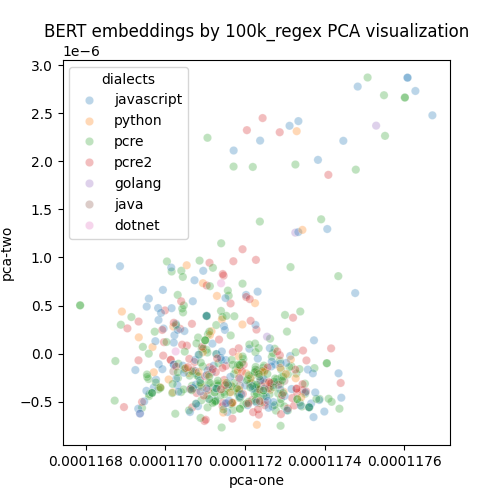
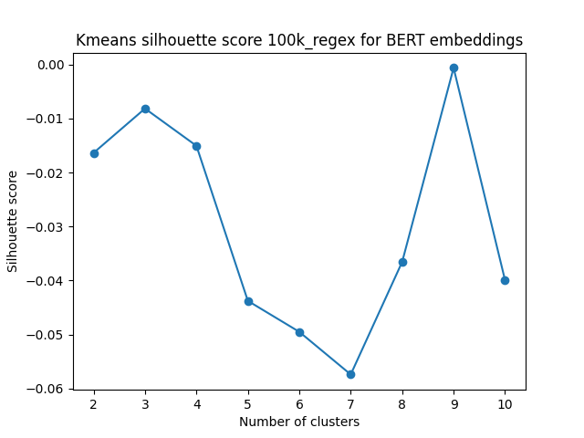

# BERT as encoder

Dataset filter: word *html*

Use BERT-100k_REGEX as a model.
<a href="https://huggingface.co/yzimmermann/BERT-100k_REGEX">Link</a> on HuggingFace.

## PCA visualization

  

## UMAP visualization

  

## Kmeans

### Silhouette score

  

