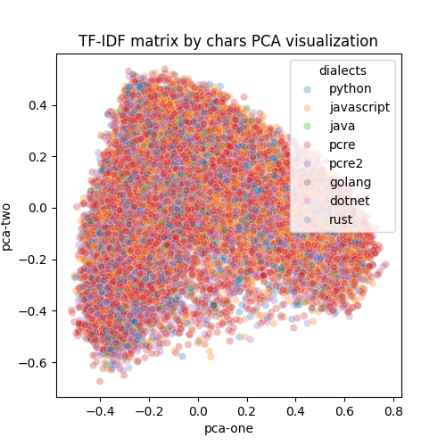
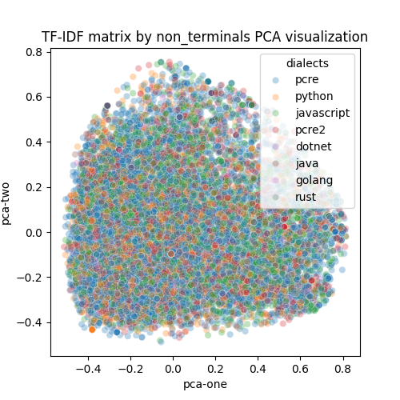
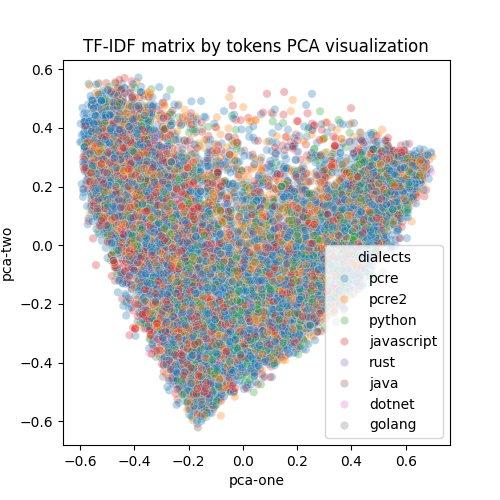
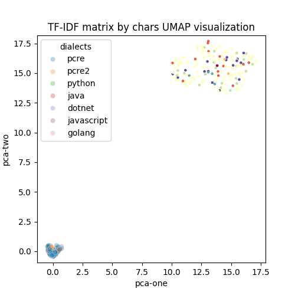
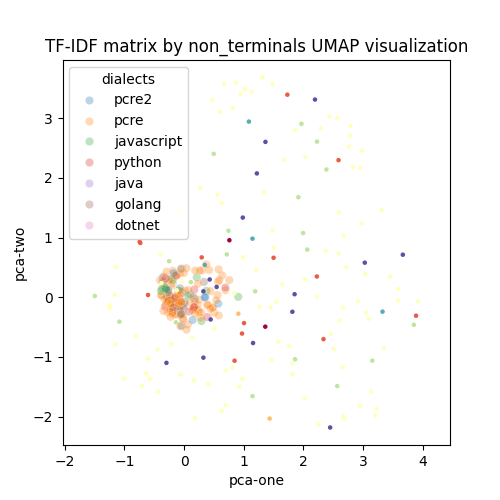
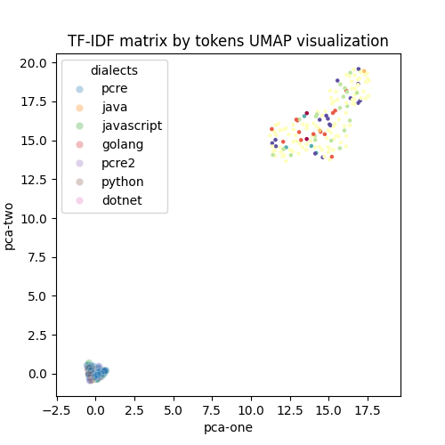
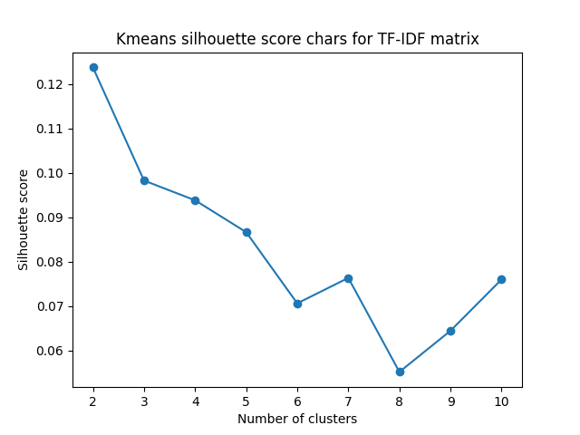
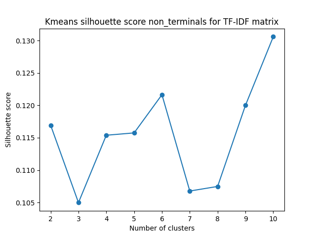
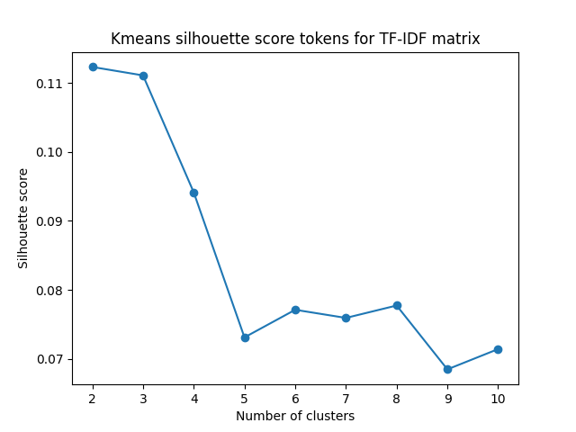

# TF-IDF as encoder

TF (Term Frequency) measures how often a certain word appears in a given document. Thus, TF measures the importance of a word in the context of a single document.
IDF (Inverse Document Frequency) measures how unique a word is across a collection of documents. Words that appear in most documents have a low IDF because they do not contribute much information value.
The TF-IDF formula combines the concepts of TF and IDF to calculate the importance of each word in each document.

Three methods of obtaining TF-IDF vectors are proposed:
- Tokenization by regular expression symbols
- Tokenization by regular expression non-terminals
- Tokenization by custom tokens (lexical analyzer as in compilers)

Dataset filter: word *html*

## PCA visualization

  
  
  

## UMAP visualization

  
  
  

## Kmeans

### Silhouette score

  
  
  

